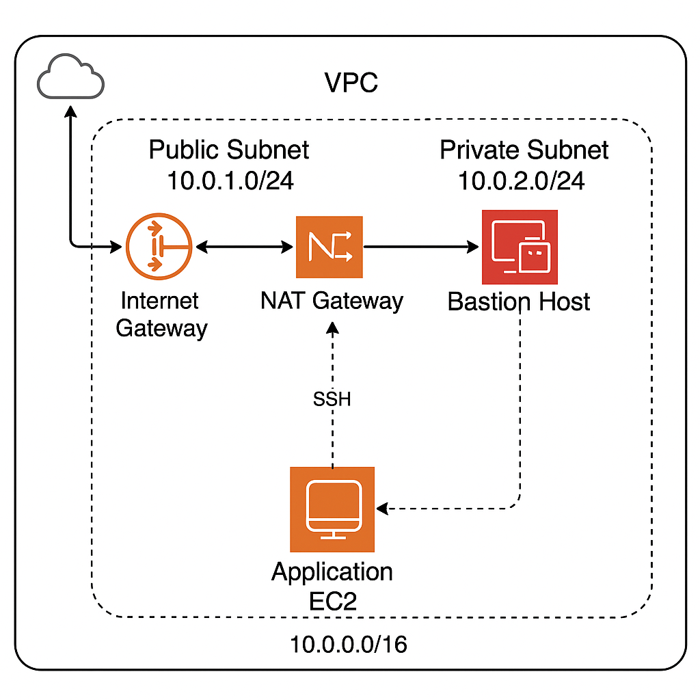

## AWS VPC Architecture with Public/Private Subnets (Terraform)

Designed and deployed a segmented AWS VPC architecture using Terraform, featuring public and private subnets, NAT Gateway and a bastion host to enforce network isolation and secure access.

---

## Overview

This project demonstrates the design and deployment of a secure AWS VPC using Terraform, focusing on network segmentation, controlled ingress/egress and least-privilege access through public/private subnets, a NAT gateway and a bastion host.

---

## What I Built

- Custom AWS VPC with public and private subnets.
- Internet Gateway and NAT Gateway for controlled ingress/egress.
- Bastion host for secure administrative access.
- Private EC2 instance with no public IP.
- Security groups enforcing least-privilege access.
- Fully automated provisioning and teardown using Terraform.

---

## Diagram

---

## Implementation Highlights

- Provisioned VPC, subnets, route tables, IGW and NAT Gateway using Terraform.
- Deployed bastion host in public subnet with restricted SSH access.
- Deployed application EC2 instance in private subnet without public exposure.
- Verified connectivity via bastion and validated outbound access through NAT.
- Destroyed all resources using Terraform to avoid ongoing costs.

---

## Screenshots

Selected screenshots are included in the `screenshots/` directory to validate deployment and connectivity.

---

## References

- [AWS VPC Documentation](https://docs.aws.amazon.com/vpc/latest/userguide/what-is-amazon-vpc.html)
- [Terraform AWS Provider](https://registry.terraform.io/providers/hashicorp/aws/latest/docs)

---

## Contact

Maintained by Sebastian Silva C. – Berlin, Germany  
LinkedIn: https://www.linkedin.com/in/sebastiansilc
